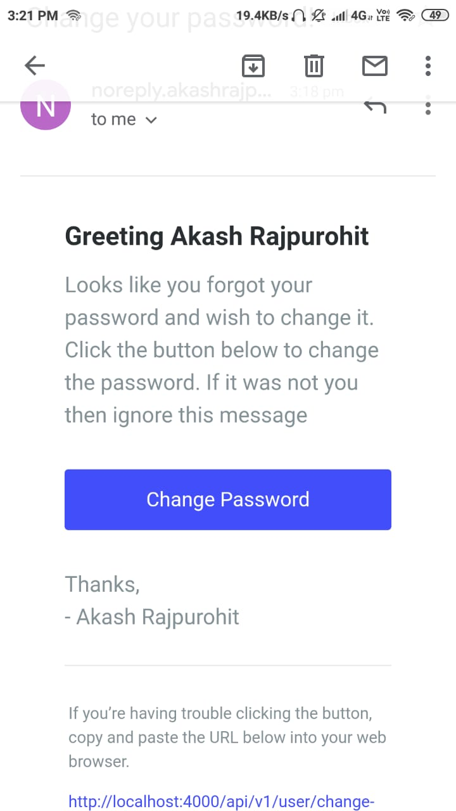

# Project: Blog + CMS (ID: JS-3)
## Project given by Levin from 'Garbage Collector' Organization from discord
## Difficulty: Intermediate to advanced

## Task
#### Build a database-driven (persistent) blog themed application, including a (small) Content-Management System (CMS) for administrators to manage it.

* Blog
* [x] Securely register and log in users => Password hashing, session management, authorization and authentication
* [x] Allow authorized users to:
  * [x] Create new blog posts - a post should include
    * [x] a title
    * [x] an author
    * [x] some content
    * [x] is published
    * [ ] (Optional): a post picture
  * [x] Edit their own posts 
  * [x] Delete their own posts (Soft Delete)
  * [x] View their own profile information, which should include
    * [x] the username
    * [x] the E-Mail
    * [ ] (Optional): a biography
    * [ ] (Optional): a profile picture
    * [x] All of their posts
    
* Get access to the CMS
  * [x] for administrators only -> differentiate between normal users and admins

* Additionally, allow everyone to:
  * [x] View all published blog posts

* CMS:
  * [x] Allow administrators only!
  * [x] Get an overview of all registered users, ability to view their information which equals the information the user should be able to see about him/herself
  * [x] Edit and delete any post
  * [x] Delete user accounts
  * [x] Create user accounts
  * [x] Grant users administrator privileges
  * [ ] (Optional): Statistics of registrations and/or posts

## Stretch - Plan to implement task apart from given
* [x] Use access token and refresh token for authentication and authorization -> super fun while implementing this 😊
* [x] User Forgot Password
  * [x] Lock user account
  * [x] Send email with token
* [x] Change password and unlock the user's account. Invalidated all old tokens in this process
* [ ] Allow user to hard delete any data (eg. Blog post)
* [ ] Likes and comments on blog post

## Graphical Assets
* Send Forgot Password Email
   
  

## Read the API Docs
[Documentation](https://documenter.getpostman.com/view/4346639/S1TZzbts)

## Deployed URL
[blog-cms-api.herokuapp.com](https://blog-cms-api.herokuapp.com/)
